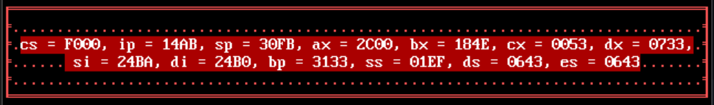
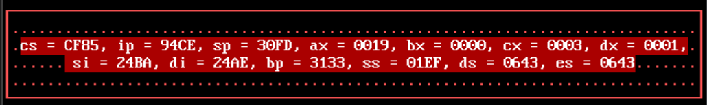
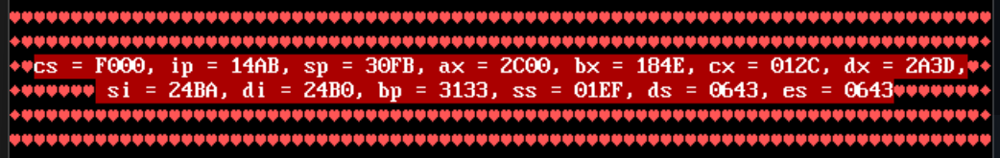
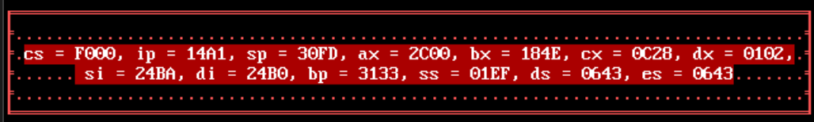
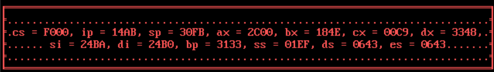
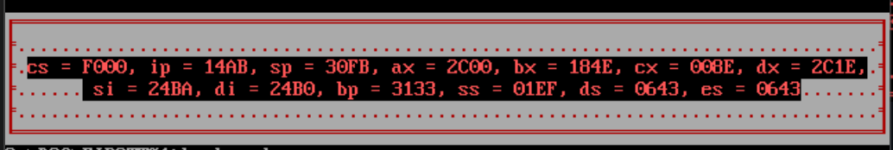
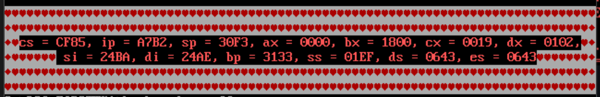
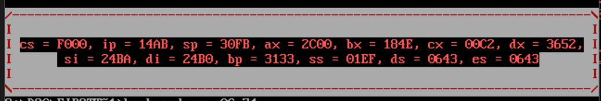
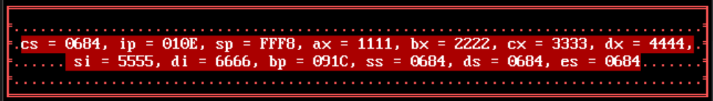

#        Работа с видеопамятью

[Печать рамки](##frame_res.asm) \
[Работа с резидентами](##keyboard.asm)


## frame_res.asm
Если вы хотите напечатать свою строку в красивой рамке на экране, то это программа для вас!

### В качестве параметров, помимо самой строки, можно указать:
* Цвет выводимой строки - по умолчанию F4h;
* Цвет рамки - по умолчанию 0Ch;
* Цвет заливки экрана - по умолчанию 05h;
* Номер рамки из дефолтных рамок (1 - 3) или 0, если хочешь задать свою рамку (в этом случае нужно перечислить 9 символов для рамки) - по умолчанию 3;
* Строка вводится после всех желаемых параметров - по умолчанию также выведется сообщение;

### Дефолтные рамки:
* Рамка 1
```
frame_res.com 4F 0C 03 1 Have a nice day
```

* Рамка 2 
```
frame_res.com 4F 0C 03 2 Have a nice day
```

* Рамка 3 
```
frame_res.com 4F 0C 03 3 Have a nice day
```


### Режимы запуска:

* Запуск без параметров
```
frame_res.com
```


* Запуск с введенной строкой
```
frame_res.com Hello, friend!
```


* Запуск с параметром цвета строки (4F) и с введенной строкой
```
frame_res.com 4F Hello, friend!
```


* Запуск с параметрами цвета строки (4F) и цвета рамки (74) и с введенной строкой
```
frame_res.com 4F 74 Hello, friend!
```


* Запуск с параметрами цвета строки (4F), цвета рамки (74) и цвета заливки (03) и с введенной строкой
```
frame_res.com 4F 74 03 Hello, friend!
```


* Запуск с параметрами цвета строки (4F), цвета рамки (74), цвета заливки (03) и номера дефолтной рамки (2) и с введенной строкой
```
frame_res.com 4F 74 03 2 Hello, friend!
```
 

* Запуск с параметрами цвета строки (4F), цвета рамки (74), цвета заливки (03) и символами для собственной рамки и с введенной строкой
```
frame_res.com 4F 74 03 0 +-+***+-+ Hello, friend!
```


## keyboard.asm

Резидентная программа для DOS, которая выводит на экран в красивой рамочке значения регистров процессора при нажатии клавиши F11 и возвращает экран в прежний вид при нажатии F12.

### Преимущества:
* Вывод значений 13 регистров: CS, IP, SP, AX, BX, CX, DX, SI, DI, BP, SS, DS, ES;
* Корректное восстановление содержимого экрана;
* Работает как резидент (остается в памяти);
* Благодаря таймеру, после нажатия клавиши F11 регистры обновляются в режиме реального времени.

### В качестве параметров можно указать:
* Цвет выводимой строки - по умолчанию 4Fh;
* Цвет рамки - по умолчанию 0Ch;
* Номер рамки из дефолтных рамок (1 - 3) или 0, если хочешь задать свою рамку (в этом случае нужно перечислить 9 символов для рамки) - по умолчанию 1.

### Дефолтные рамки:
* Рамка 1
```
keyboard.com 4F 0C 1
```

* Рамка 2 
```
keyboard.com 4F 0C 2
```

* Рамка 3 
```
keyboard.com 4F 0C 3
```


### Режимы запуска:

* Запуск без параметров
```
keyboard.com
```


* Запуск с параметром цвета регистров (0C)
```
keyboard.com 0C
```


* Запуск с параметрами цвета регистров (0C) и цвета рамки (74)
```
keyboard.com 0C 74
```


* Запуск с параметрами цвета регистров (0C), цвета рамки (74) и номера дефолтной рамки (3)
```
keyboard.com 0C 74 3
```


* Запуск с параметрами цвета регистров (0C), цвета рамки (74) и символами для собственной рамки
```
keyboard.com 0C 74 0 /-\I I\-/
```


### Тестирование:
Достаточно запустить программу "test_res.asm" и увидеть, что соответствующие регистры принимают правильные значения:
```
@@loop:
        in al, 60h
        cmp al, 01h         ; esc         
        je  @@done

        mov ax, 1111h
        mov bx, 2222h
        mov cx, 3333h
        mov dx, 4444h
        mov si, 5555h
        mov di, 6666h

        jmp @@loop
```
Для запуска нужно написать в командную строку:
```
test_res.com
```
