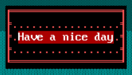
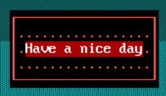
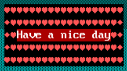
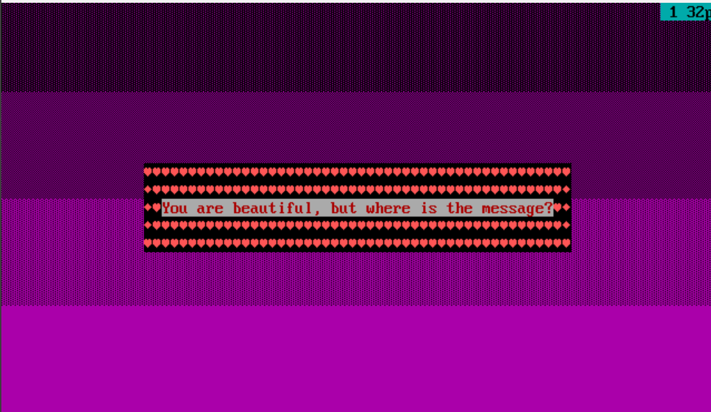
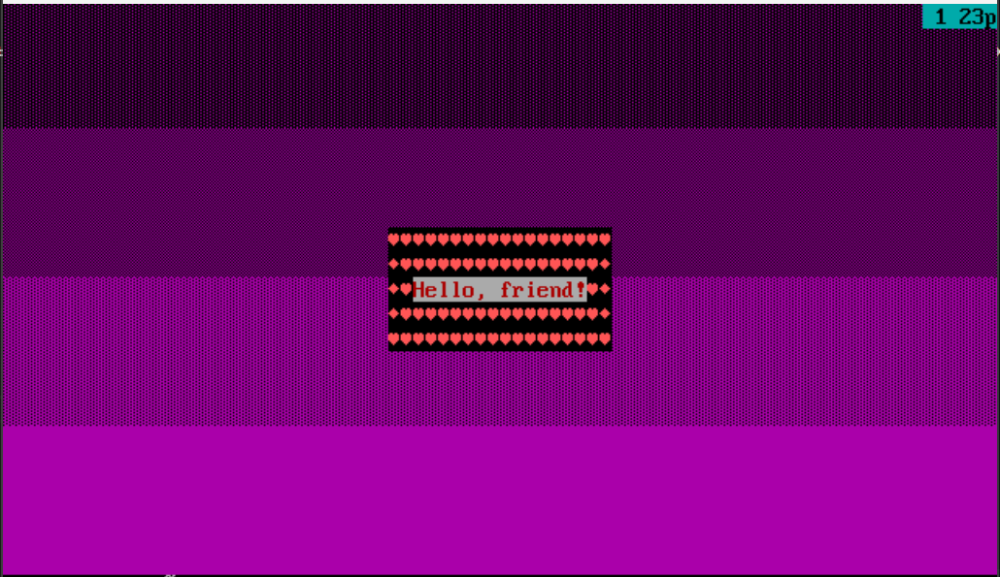
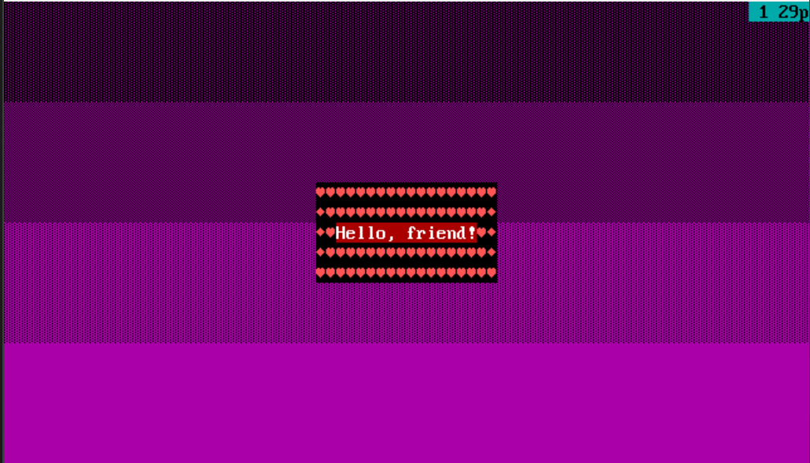
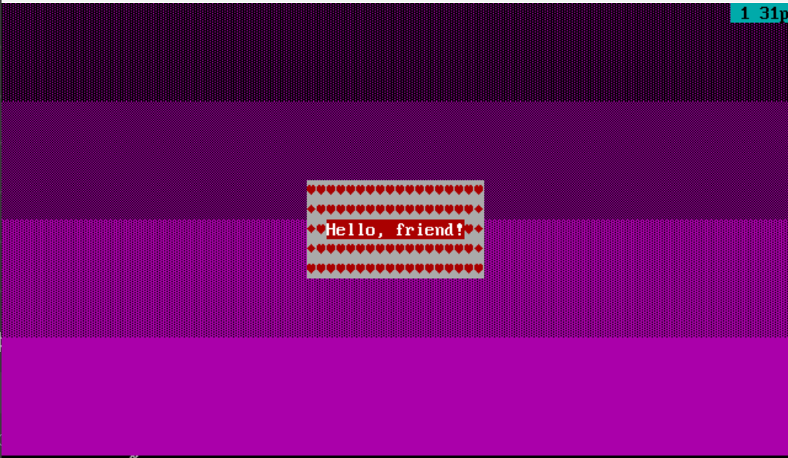
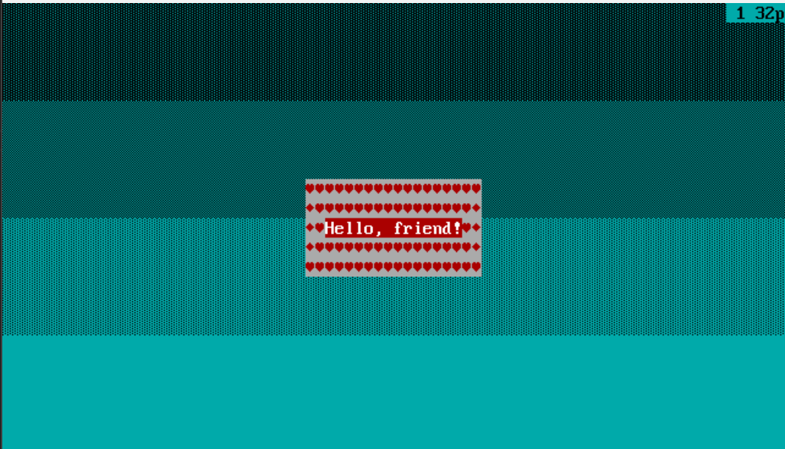
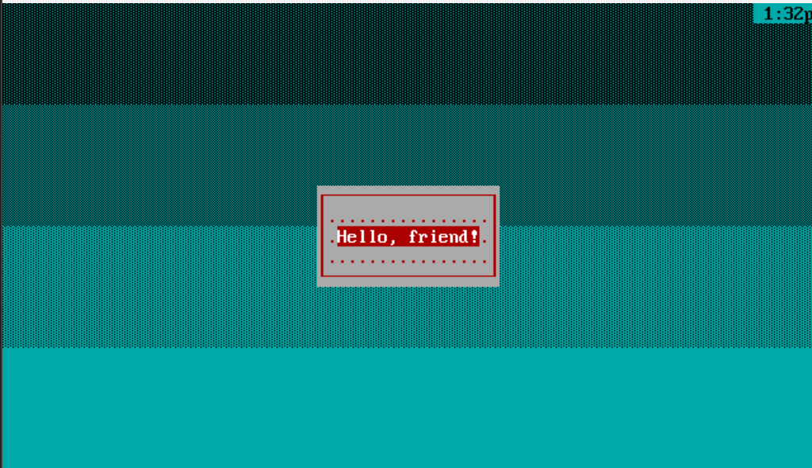
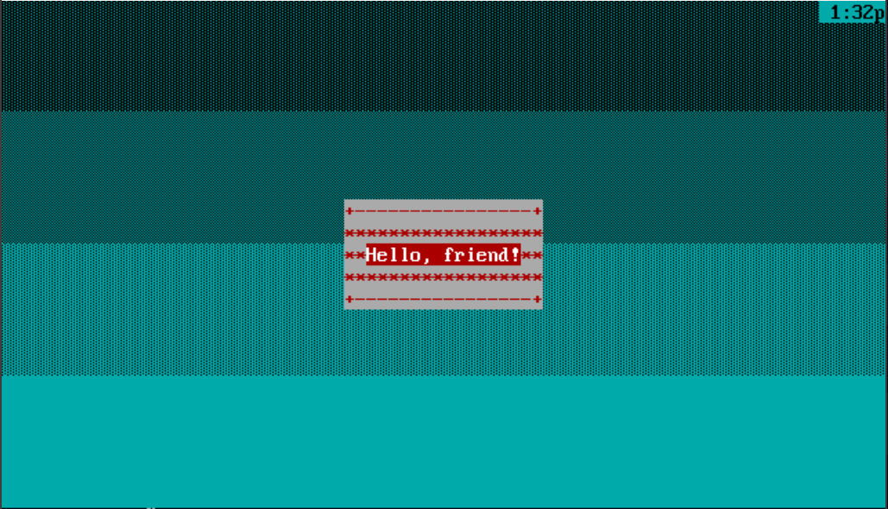

#        Работа с видеопамятью


## frame_res.asm
Если вы хотите напечатать свою строку в красивой рамке на экране, то это программа для вас!

### В качестве параметров, помимо самой строки, можно указать:
* Цвет выводимой строки - по умолчанию F4h;
* Цвет рамки - по умолчанию 0Ch;
* Цвет заливки экрана - по умолчанию 05h;
* Номер рамки из дефолтных рамок (1 - 3) или 0, если хочешь задать свою рамку (в этом случае нужно перечислить 9 символов для рамки) - по умолчанию 3;
* Строка вводится после всех желаемых параметров - по умолчанию также выведется сообщение;

### Дефолтные рамки:
* Рамка 1
```
frame_res.com 4F 0C 03 1 Have a nice day
```

* Рамка 2 
```
frame_res.com 4F 0C 03 2 Have a nice day
```

* Рамка 3 
```
frame_res.com 4F 0C 03 3 Have a nice day
```



### Режимы запуска:

* Запуск без параметров
```
frame_res.com
```


* Запуск с введенной строкой
```
frame_res.com Hello, friend!
```


* Запуск с параметром цвета строки (4F) и с введенной строкой
```
frame_res.com 4F Hello, friend!
```


* Запуск с параметрами цвета строки (4F) и цвета рамки (74) и с введенной строкой
```
frame_res.com 4F 74 Hello, friend!
```


* Запуск с параметрами цвета строки (4F), цвета рамки (74) и цвета заливки (03) и с введенной строкой
```
frame_res.com 4F 74 03 Hello, friend!
```


* Запуск с параметрами цвета строки (4F), цвета рамки (74), цвета заливки (03) и номера дефолтной рамки (2) и с введенной строкой
```
frame_res.com 4F 74 03 2 Hello, friend!
```
 

* Запуск с параметрами цвета строки (4F), цвета рамки (74), цвета заливки (03) и символами для собственной рамки и с введенной строкой
```
frame_res.com 4F 74 03 0 +-+***+-+ Hello, friend!
```
